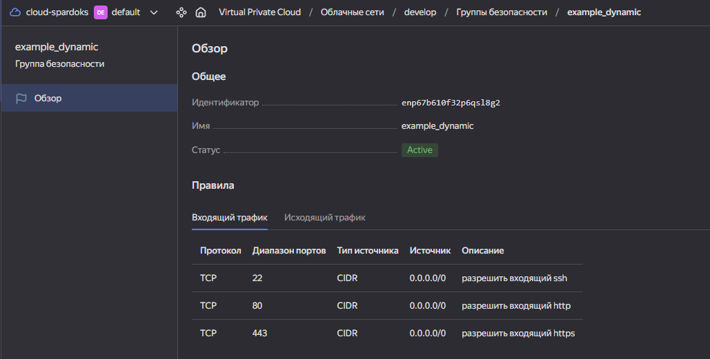
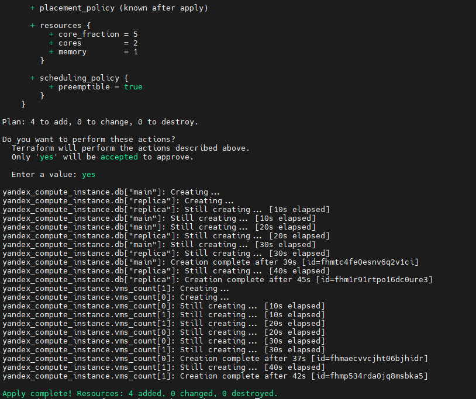
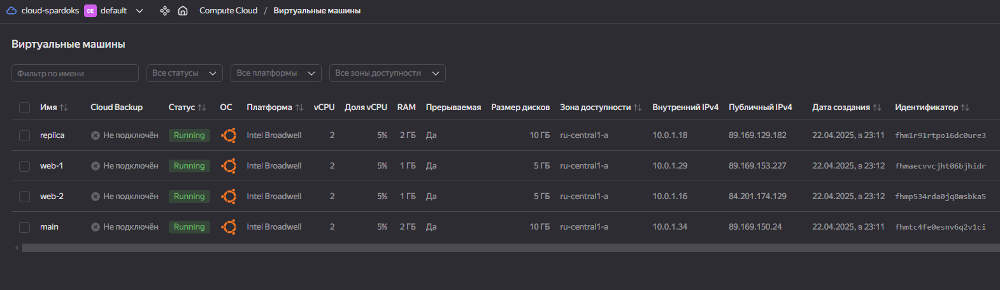
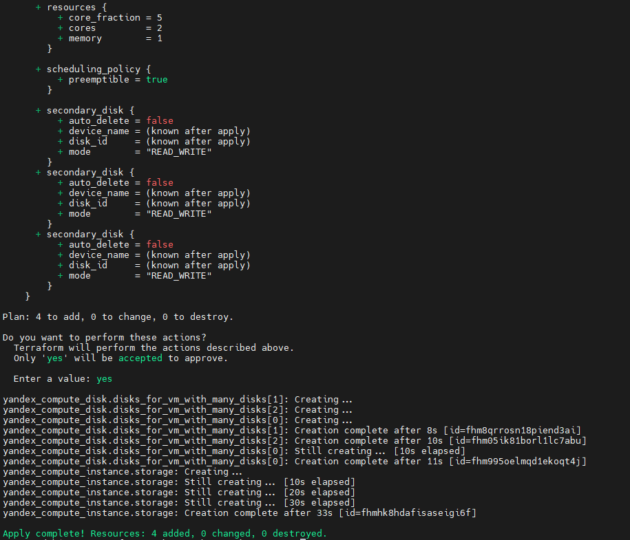
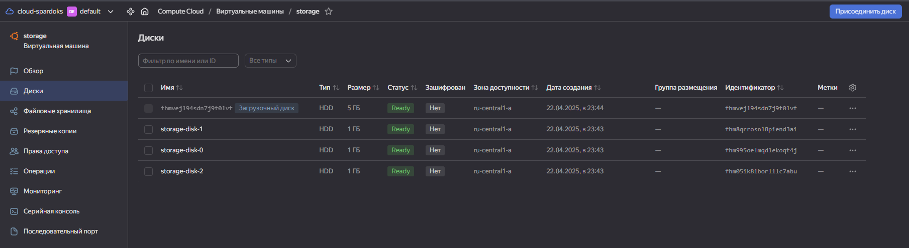
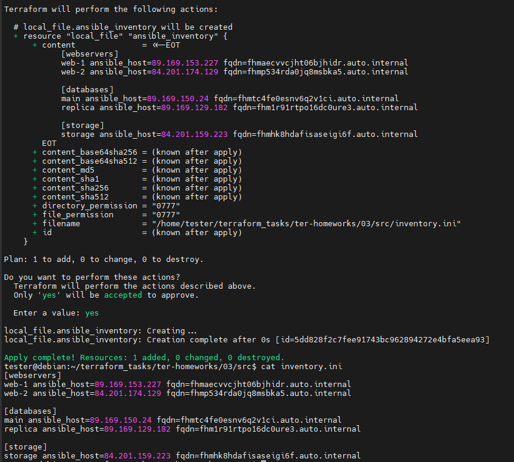

# Домашнее задание к занятию «Управляющие конструкции в коде Terraform»

https://github.com/netology-code/ter-homeworks/blob/main/03/hw-03.md


## Чек-лист готовности к домашнему заданию

1. Зарегистрирован аккаунт в Yandex Cloud. Использован промокод на грант.
2. Установлен инструмент Yandex CLI.
3. Доступен исходный код для выполнения задания в директории [**03/src**](https://github.com/netology-code/ter-homeworks/tree/main/03/src).
4. Любые ВМ, использованные при выполнении задания, должны быть прерываемыми, для экономии средств.

Убедитесь что ваша версия **Terraform** ~>1.8.4
Теперь пишем красивый код, хардкод значения не допустимы!

## Задание 1

1. Изучите проект.
2. Инициализируйте проект, выполните код. 


Приложите скриншот входящих правил «Группы безопасности» в ЛК Yandex Cloud .

## Решение 1

1. Готовимся к инициализации
    ```
    # Terraform v1.11.4

    ssh-keygen -t ed25519

    yc config profile activate sa-profile
    export YC_TOKEN=$(yc iam create-token)
    export YC_CLOUD_ID=$(yc config get cloud-id)
    export YC_FOLDER_ID=$(yc config get folder-id)

    cd 03/src
    cp .terraformrc ~/.terraformrc

    # настраиваем personal.auto.tfvars
    cat > personal.auto.tfvars << EOF
    token        = "${YC_TOKEN}"
    cloud_id     = "${YC_CLOUD_ID}"
    folder_id    = "${YC_FOLDER_ID}"
    EOF
    ```
2. Инициализируем проект
    ```
    terraform init
    terraform validate
    terraform plan
    terraform apply
    ```
    

## Задание 2

1. Создайте файл count-vm.tf. Опишите в нём создание двух **одинаковых** ВМ  web-1 и web-2 (не web-0 и web-1) с минимальными параметрами, используя мета-аргумент **count loop**. Назначьте ВМ созданную в первом задании группу безопасности.(как это сделать узнайте в документации провайдера yandex/compute_instance )
2. Создайте файл for_each-vm.tf. Опишите в нём создание двух ВМ для баз данных с именами "main" и "replica" **разных** по cpu/ram/disk_volume , используя мета-аргумент **for_each loop**. Используйте для обеих ВМ одну общую переменную типа:
```
variable "each_vm" {
  type = list(object({  vm_name=string, cpu=number, ram=number, disk_volume=number }))
}
```  
При желании внесите в переменную все возможные параметры.

4. ВМ из пункта 2.1 должны создаваться после создания ВМ из пункта 2.2.
5. Используйте функцию file в local-переменной для считывания ключа ~/.ssh/id_rsa.pub и его последующего использования в блоке metadata, взятому из ДЗ 2.
6. Инициализируйте проект, выполните код.

## Решение 2

1. Создаём `count-vm.tf`
    ```
    # vms with count


    ## basical vars

    variable "vm_count_image_family" {
      type    = string
      default = "ubuntu-2004-lts"
    }

    variable "vm_count_name" {
      type    = string
      default = "web"
    }

    variable "vm_count_platform_id" {
      type    = string
      default = "standard-v1"
    }

    variable "vm_count_preemptible" {
      type    = bool
      default = true
    }

    variable "vm_count_nat" {
      type    = bool
      default = true
    }

    variable "vm_count_serial_port_enable" {
      type    = number
      default = 1
    }


    ## resources

    variable "vm_count_resources" {
      type = object({
        cores = number
        memory = number
        core_fraction = number
      })
      default = {
          cores = 2
          memory = 1
          core_fraction = 5
      }
    }


    ## vm_ssh

    locals {
      ssh_vm_count_pub_key = "ubuntu:${file("./ed25519_pub")}"
    }


    ## os

    data "yandex_compute_image" "vm_count_os" {
      family = var.vm_count_image_family
    }


    ## vms

    resource "yandex_compute_instance" "vms_count" {
      count = 2
      name = "${var.vm_count_name}-${count.index + 1}"
      platform_id = var.vm_count_platform_id

      resources {
        cores         = var.vm_count_resources.cores
        memory        = var.vm_count_resources.memory
        core_fraction = var.vm_count_resources.core_fraction
      }

      boot_disk {
        initialize_params {
          image_id = data.yandex_compute_image.vm_count_os.id
        }
      }

      scheduling_policy {
        preemptible = var.vm_count_preemptible
      }

      network_interface {
        subnet_id = yandex_vpc_subnet.develop.id
        nat       = var.vm_count_nat
        security_group_ids = [yandex_vpc_security_group.example.id]
      }

      metadata = {
        serial-port-enable = var.vm_count_serial_port_enable
        ssh-keys = local.ssh_vm_count_pub_key
      }

      depends_on = [yandex_compute_instance.db]
    }
    ```
2. Создаём `for_each-vm.tf`
    ```
    # vms with for_each


    ## basical vars

    variable "vm_for_each_image_family" {
      type    = string
      default = "ubuntu-2004-lts"
    }

    variable "vm_for_each_count_name" {
      type    = string
      default = "db"
    }

    variable "vm_for_each_platform_id" {
      type    = string
      default = "standard-v1"
    }

    variable "vm_for_each_preemptible" {
      type    = bool
      default = true
    }

    variable "vm_for_each_nat" {
      type    = bool
      default = true
    }

    variable "vm_for_each_serial_port_enable" {
      type    = number
      default = 1
    }


    ## resources

    variable "each_vm" {
      type = list(object({  vm_name=string, cpu=number, ram=number, disk_volume=number, core_fraction=number }))
      default = [
        { vm_name = "main", cpu = 2, ram = 2, disk_volume = 10, core_fraction = 5 },
        { vm_name = "replica", cpu = 2, ram = 2, disk_volume = 10, core_fraction = 5 }
      ]
    }


    ## vm_ssh

    locals {
      ssh_for_each_pub_key = "ubuntu:${file("./ed25519_pub")}"
    }


    ## os

    data "yandex_compute_image" "vm_for_each_os" {
      family = var.vm_for_each_image_family
    }


    ## vms

    resource "yandex_compute_instance" "db" {
      # for_each = {
      #  main = {
      #    vm_name = "main"
      #    cpu     = 2
      #    ram     = 2
      #    disk_volume = 10
      #    core_fraction = 5
      #  },
      #  replica = {
      #    vm_name = "replica"
      #    cpu     = 2
      #    ram     = 2
      #    disk_volume = 10
      #    core_fraction = 5
      #  }
      # }

      for_each = { for vm in var.each_vm: vm.vm_name => vm }

      name = each.value.vm_name

      resources {
        cores         = each.value.cpu
        memory        = each.value.ram
        core_fraction = each.value.core_fraction
      }

      platform_id = var.vm_for_each_platform_id

      boot_disk {
        initialize_params {
          image_id = data.yandex_compute_image.vm_for_each_os.id
          size     = each.value.disk_volume
        }
      }

      scheduling_policy {
        preemptible = var.vm_for_each_preemptible
      }

      network_interface {
        subnet_id = yandex_vpc_subnet.develop.id
        nat       = var.vm_for_each_nat
        security_group_ids = [yandex_vpc_security_group.example.id]
      }

      metadata = {
        serial-port-enable = var.vm_for_each_serial_port_enable
        ssh-keys = local.ssh_for_each_pub_key
      }
    }
    ```
3. Пробуем создать сущности через `terraform apply`, убедившись через `terraform plan`, что создадудться 4 машины с ожидаемыми конфигурациями
    
    

## Задание 3

1. Создайте 3 одинаковых виртуальных диска размером 1 Гб с помощью ресурса yandex_compute_disk и мета-аргумента count в файле **disk_vm.tf** .
2. Создайте в том же файле **одиночную**(использовать count или for_each запрещено из-за задания №4) ВМ c именем "storage"  . Используйте блок **dynamic secondary_disk{..}** и мета-аргумент for_each для подключения созданных вами дополнительных дисков.

## Решение 3

1. Создаём 3 диска в `disk_vm.tf`
    ```
    resource "yandex_compute_disk" "disks_for_vm_with_many_disks" {
      count = 3

      name     = "${var.vm_many_disks_name}-disk-${count.index}"
      type     = "network-hdd"
      size     = 1 # 1 Gb
      zone     = "ru-central1-a"
    }
    ```
2. Создаём виртуальную машину и подключаем к ней динамическим блоком созданные 3 диска
    ```
    # vm with many disks

    ## basical vars

    variable "vm_many_disks_image_family" {
      type    = string
      default = "ubuntu-2004-lts"
    }

    variable "vm_many_disks_name" {
      type    = string
      default = "storage"
    }

    variable "vm_many_disks_platform_id" {
      type    = string
      default = "standard-v1"
    }

    variable "vm_many_disks_preemptible" {
      type    = bool
      default = true
    }

    variable "vm_many_disks_nat" {
      type    = bool
      default = true
    }

    variable "vm_many_disks_serial_port_enable" {
      type    = number
      default = 1
    }


    ## resources

    variable "vm_many_disks_resources" {
      type = object({
        cores = number
        memory = number
        core_fraction = number
      })
      default = {
          cores = 2
          memory = 1
          core_fraction = 5
      }
    }


    ## vm_ssh

    locals {
      ssh_vm_many_disks_pub_key = "ubuntu:${file("./ed25519_pub")}"
    }


    ## os

    data "yandex_compute_image" "vm_many_disks_os" {
      family = var.vm_many_disks_image_family
    }


    ## disks

    resource "yandex_compute_disk" "disks_for_vm_with_many_disks" {
      count = 3

      name     = "${var.vm_many_disks_name}-disk-${count.index}"
      type     = "network-hdd"
      size     = 1 # 1 Gb
      zone     = "ru-central1-a"
    }


    ## vms

    resource "yandex_compute_instance" "storage" {
      name = var.vm_many_disks_name
      platform_id = var.vm_many_disks_platform_id

      resources {
        cores         = var.vm_many_disks_resources.cores
        memory        = var.vm_many_disks_resources.memory
        core_fraction = var.vm_many_disks_resources.core_fraction
      }

      boot_disk {
        initialize_params {
          image_id = data.yandex_compute_image.vm_many_disks_os.id
        }
      }

      dynamic "secondary_disk" {
        for_each = toset(yandex_compute_disk.disks_for_vm_with_many_disks[*].id)
        content {
          disk_id = secondary_disk.value
        }
      }

      scheduling_policy {
        preemptible = var.vm_many_disks_preemptible
      }

      network_interface {
        subnet_id = yandex_vpc_subnet.develop.id
        nat       = var.vm_many_disks_nat
        security_group_ids = [yandex_vpc_security_group.example.id]
      }

      metadata = {
        serial-port-enable = var.vm_many_disks_serial_port_enable
        ssh-keys = local.ssh_vm_many_disks_pub_key
      }
    }
    ```
3. Пробуем создать сущности через `terraform apply`, убедившись через `terraform plan`, что создадудться 3 диска и 1 машина с подключением в неё этих дисков
    
    

## Задание 4

1. В файле ansible.tf создайте inventory-файл для ansible.
Используйте функцию tepmplatefile и файл-шаблон для создания ansible inventory-файла из лекции.
Готовый код возьмите из демонстрации к лекции [**demonstration2**](https://github.com/netology-code/ter-homeworks/tree/main/03/demo).
Передайте в него в качестве переменных группы виртуальных машин из задания 2.1, 2.2 и 3.2, т. е. 5 ВМ.
2. Инвентарь должен содержать 3 группы и быть динамическим, т. е. обработать как группу из 2-х ВМ, так и 999 ВМ.
3. Добавьте в инвентарь переменную  [**fqdn**](https://cloud.yandex.ru/docs/compute/concepts/network#hostname).
``` 
[webservers]
web-1 ansible_host=<внешний ip-адрес> fqdn=<полное доменное имя виртуальной машины>
web-2 ansible_host=<внешний ip-адрес> fqdn=<полное доменное имя виртуальной машины>

[databases]
main ansible_host=<внешний ip-адрес> fqdn=<полное доменное имя виртуальной машины>
replica ansible_host<внешний ip-адрес> fqdn=<полное доменное имя виртуальной машины>

[storage]
storage ansible_host=<внешний ip-адрес> fqdn=<полное доменное имя виртуальной машины>
```
Пример fqdn: ```web1.ru-central1.internal```(в случае указания переменной hostname(не путать с переменной name)); ```fhm8k1oojmm5lie8i22a.auto.internal```(в случае отсутвия перменной hostname - автоматическая генерация имени,  зона изменяется на auto). нужную вам переменную найдите в документации провайдера или terraform console.
4. Выполните код. Приложите скриншот получившегося файла. 

## Решение 4

1. Создаём `inventory.tftpl`
    ```
    [webservers]
    %{ for vm in webservers ~}
    ${vm.name} ansible_host=${vm.network_interface[0].nat_ip_address} fqdn=${vm.fqdn}
    %{ endfor ~}

    [databases]
    %{ for vm in databases ~}
    ${vm.name} ansible_host=${vm.network_interface[0].nat_ip_address} fqdn=${vm.fqdn}
    %{ endfor ~}

    [storage]
    %{ for vm in storage ~}
    ${vm.name} ansible_host=${vm.network_interface[0].nat_ip_address} fqdn=${vm.fqdn}
    %{ endfor ~}
    ```
2. Создаём `ansible.tf`
    ```
    resource "local_file" "ansible_inventory" {
      content = templatefile("${path.module}/inventory.tftpl", {
        webservers = yandex_compute_instance.vms_count[*],
        databases  = values(yandex_compute_instance.db)[*],
        storage    = [yandex_compute_instance.storage]
      })
      filename = "${abspath(path.module)}/inventory.ini"
    }
    ```
3. Создаём inventory файл через `terraform apply`, перед этим выполнив снова `terraform init` для подгрузки необходимых зависимостей
    
    ```
    # проверить работу inventory можно, например, подобными действиями
    eval $(ssh-agent) && cat ./ed25519_priv | ssh-add -
    ansible all -i inventory.ini -m ping --private-key ./ed25519_priv -u ubuntu
    ```

## Дополнительные задания (со звездочкой*)

### Задание 5* (необязательное)
1. Напишите output, который отобразит ВМ из ваших ресурсов count и for_each в виде списка словарей :
``` 
[
 {
  "name" = 'имя ВМ1'
  "id"   = 'идентификатор ВМ1'
  "fqdn" = 'Внутренний FQDN ВМ1'
 },
 {
  "name" = 'имя ВМ2'
  "id"   = 'идентификатор ВМ2'
  "fqdn" = 'Внутренний FQDN ВМ2'
 },
 ....
...итд любое количество ВМ в ресурсе(те требуется итерация по ресурсам, а не хардкод) !!!!!!!!!!!!!!!!!!!!!
]
```
Приложите скриншот вывода команды ```terrafrom output```.

------

### Задание 6* (необязательное)

1. Используя null_resource и local-exec, примените ansible-playbook к ВМ из ansible inventory-файла.
Готовый код возьмите из демонстрации к лекции [**demonstration2**](https://github.com/netology-code/ter-homeworks/tree/main/03/demo).
3. Модифицируйте файл-шаблон hosts.tftpl. Необходимо отредактировать переменную ```ansible_host="<внешний IP-address или внутренний IP-address если у ВМ отсутвует внешний адрес>```.

Для проверки работы уберите у ВМ внешние адреса(nat=false). Этот вариант используется при работе через bastion-сервер.
Для зачёта предоставьте код вместе с основной частью задания.

### Задание 7* (необязательное)
Ваш код возвращает вам следущий набор данных: 
```
> local.vpc
{
  "network_id" = "enp7i560tb28nageq0cc"
  "subnet_ids" = [
    "e9b0le401619ngf4h68n",
    "e2lbar6u8b2ftd7f5hia",
    "b0ca48coorjjq93u36pl",
    "fl8ner8rjsio6rcpcf0h",
  ]
  "subnet_zones" = [
    "ru-central1-a",
    "ru-central1-b",
    "ru-central1-c",
    "ru-central1-d",
  ]
}
```
Предложите выражение в terraform console, которое удалит из данной переменной 3 элемент из: subnet_ids и subnet_zones.(значения могут быть любыми) Образец конечного результата:
```
> <некое выражение>
{
  "network_id" = "enp7i560tb28nageq0cc"
  "subnet_ids" = [
    "e9b0le401619ngf4h68n",
    "e2lbar6u8b2ftd7f5hia",
    "fl8ner8rjsio6rcpcf0h",
  ]
  "subnet_zones" = [
    "ru-central1-a",
    "ru-central1-b",
    "ru-central1-d",
  ]
}
```
### Задание 8* (необязательное)
Идентифицируйте и устраните намеренно допущенную в tpl-шаблоне ошибку. Обратите внимание, что terraform сам сообщит на какой строке и в какой позиции ошибка!
```
[webservers]
%{~ for i in webservers ~}
${i["name"]} ansible_host=${i["network_interface"][0]["nat_ip_address"] platform_id=${i["platform_id "]}}
%{~ endfor ~}
```

### Задание 9* (необязательное)
Напишите  terraform выражения, которые сформируют списки:
1. ["rc01","rc02","rc03","rc04",rc05","rc06",rc07","rc08","rc09","rc10....."rc99"] те список от "rc01" до "rc99"
2. ["rc01","rc02","rc03","rc04",rc05","rc06","rc11","rc12","rc13","rc14",rc15","rc16","rc19"....."rc96"] те список от "rc01" до "rc96", пропуская все номера, заканчивающиеся на "0","7", "8", "9", за исключением "rc19"